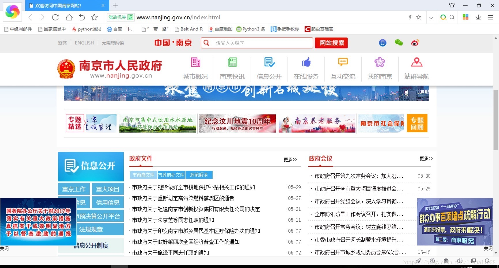
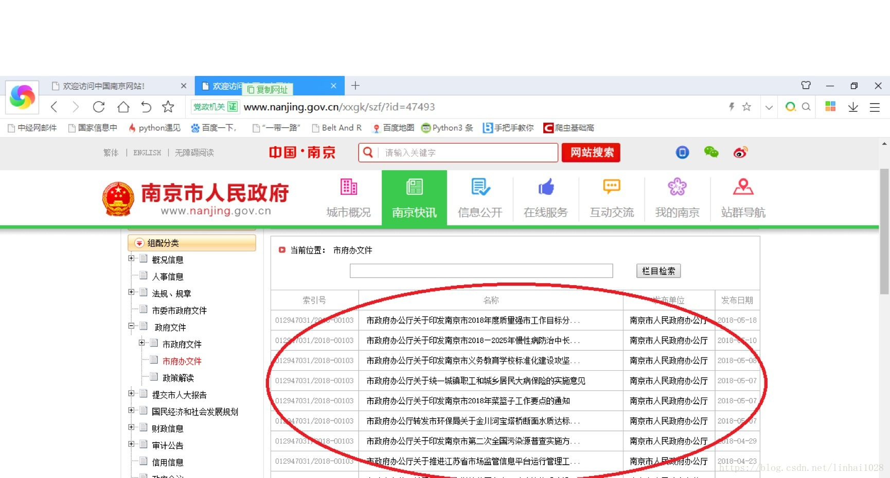
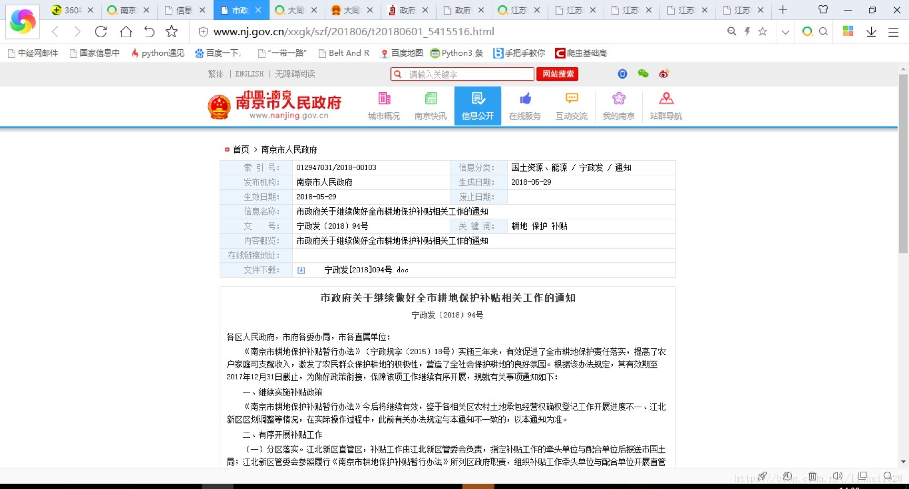
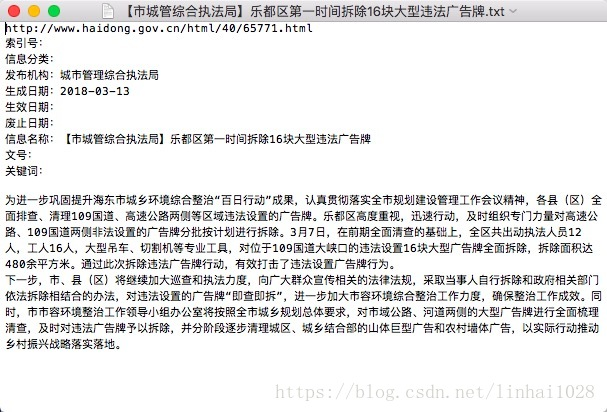
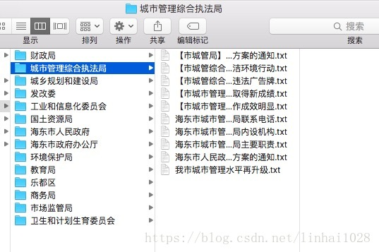

访问一些政府网站并获取网页
根据需求解析出其中的政策性文件以需求的数据
保存到本地，如果失败则记录在日志中
github: https://github.com/hailinli/crawGovData/
blog: https://blog.csdn.net/linhai1028/

------

## 一、需求介绍（示例南京）
需求介绍见文档https://github.com/hailinli/crawGovData/tree/master/data/%E9%9C%80%E6%B1%82
下面为一个市的需求示例

1. 进入政府（部门）官网 http://www.nanjing.gov.cn/index.html 找出其中的政府文件栏目，一般在信息公开中


2. 进入政府文件网站http://www.nanjing.gov.cn/xxgk/szf/?id=47493红色画圈部分为需要采集的文章。

采集范围为：市政府文件、市政府办公厅文件、部门文件、区文件

3. 进入文章页面

将网页其中的部分内容爬取存储到本地TXT（名称为文件标题）
需采集网页URL、文件信息、文件内容
将网页中的文件下载存储到相应文件夹中，以文章标题命。
具体参考示例

4. 网页中有下载链接或者附件的也需下载到相应的文件夹中



## 二、代码

源代码: https://github.com/hailinli/crawGovData/

1. https://github.com/hailinli/crawGovData/blob/master/crawBase.py 爬虫基类，主要用于下载网页（包括启动浏览器下载和程序下载网页），下载图片，获取某html标签的文字内容，下载某大标签的所有文字。
2. https://github.com/hailinli/crawGovData/blob/master/log.py 日志类，主要用于写日志，用于保存程序运行过程所需日志，运行后日志保存在logs文件中，以日期命名。
3. craw****.py 主要对应于具体某市网站的网站数据抓取类。

## 三、 运行

```
cd crawGovData/
python craw****.py  # craw****.py 指具体的某市网站数据抓取类
```
如爬取太原市的数据
```
cd crawGovData/crawTaiyuann/
python crawTaiyuan.py
python crawTaiyuanFgw.py
python crawTaiyuanWjw.py
...
python crawTaiyuanjxw.py	
```

------

## 环境
1. python3
2. requests2.18
3. lxml4.2
